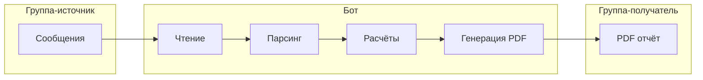

# План проекта: Telegram-бот для расчётов и PDF-отчётов

## Цель и поток данных



- **Вход:** сообщения в группе-источнике (структурированные: дата, сумма, категория или таблица).
- **Выход:** PDF-отчёт в группе-получателе.
- **Триггер:** каждое полученное ботом сообщение в группе-источнике запускает весь пайплайн (парсинг → расчёты → PDF → отправка в другую группу).

---

## 1. Стек и зависимости

| Назначение        | Библиотека                                     | Зачем                                                 |
| ----------------- | ---------------------------------------------- | ----------------------------------------------------- |
| Telegram API      | **aiogram** 3.x                                | Long polling или webhook, работа с группами и правами |
| Парсинг структуры | Регулярные выражения + опционально `pandas`   | Извлечение дат, сумм, категорий из текста/таблиц     |
| PDF               | `reportlab` или `weasyprint`                    | Генерация отчёта (таблицы, итоги, даты)               |
| Конфиг            | `pydantic-settings` + `.env`                    | Токен бота, ID групп, параметры парсинга              |

Используем **aiogram** 3.x для Telegram Bot API.

---

## 2. Структура проекта

```
eLibroBot/
├── .env.example          # Шаблон: BOT_TOKEN, SOURCE_GROUP_ID, TARGET_GROUP_ID
├── .env                  # Не в git
├── requirements.txt
├── README.md
├── config.py             # Загрузка настроек (pydantic-settings)
├── main.py               # Точка входа, запуск бота
├── bot/
│   ├── __init__.py
│   ├── handlers.py       # Обработка входящих сообщений: пайплайн parse → calc → PDF → send
│   └── filters.py        # Фильтр: только сообщения из SOURCE_GROUP_ID
├── parser/
│   ├── __init__.py
│   ├── models.py         # Модели данных: Record(date, amount, category)
│   └── parser.py         # Парсинг текста/таблицы в список Record
├── report/
│   ├── __init__.py
│   ├── calculator.py     # Расчёты по списку Record (суммы, по категориям, периоду)
│   └── pdf_builder.py    # Генерация PDF по результатам расчётов
├── tests/                # Опционально: pytest для parser и calculator
└── docs/
    ├── PROJECT_PLAN.md   # Этот документ
    └── STEPS.md          # Пошаговый разбор реализации
```

---

## 3. Ключевые компоненты

### 3.1 Конфигурация

- **Переменные:** `BOT_TOKEN`, `SOURCE_GROUP_ID`, `TARGET_GROUP_ID`; опционально `ALLOWED_USER_IDS` — обрабатывать сообщения только от этих пользователей.
- Группы: ID берутся из Telegram (бот должен быть добавлен в обе группы; ID можно получить через @userinfobot или логирование `message.chat.id`).

### 3.2 Триггер: получение сообщения

- Бот реагирует **на каждое сообщение** в группе-источнике (где `message.chat.id == SOURCE_GROUP_ID`).
- Игнорировать служебные сообщения: обрабатывать только сообщения с текстом (`message.text`).
- Опционально: фильтр по отправителю (`ALLOWED_USER_IDS`).
- Пайплайн на одно сообщение: **парсинг текста → расчёты → генерация PDF → отправка в TARGET_GROUP_ID**.

### 3.3 Парсинг структурированных сообщений

- **Модель данных:** `Record(date=date, amount=Decimal, category=str, raw_text=str)`.
- **Формат сообщений:** построчно `дата сумма категория` или таблица (markdown/plain).
- В `parser/parser.py`: разбить текст на строки, regex/split, собрать список `Record`. Пропуск невалидных строк + лог.

### 3.4 Расчёты

- Вход: список `Record`. Выход: агрегаты (общая сумма, по категориям, по периодам).
- В `report/calculator.py`; результат — структура для `pdf_builder`.

### 3.5 Генерация PDF

- `reportlab`: заголовок, период, таблица, итоги, дата генерации. Временный файл → отправка → удаление.

### 3.6 Отправка в другую группу

- В **aiogram**: `message.bot.send_document(chat_id=TARGET_GROUP_ID, document=...)`. Бот должен быть в группе-получателе.

---

## 4. Пайплайн на одно сообщение

1. Бот получает обновление с `message.text` в чате `chat_id == SOURCE_GROUP_ID`.
2. Парсер → список `Record`.
3. Калькулятор → агрегаты для отчёта.
4. Генерация PDF во временный файл.
5. Отправка в `TARGET_GROUP_ID`, удаление файла.

При пустом парсинге или ошибке — молча пропустить или уведомить в группу-источник (на усмотрение).

---

## 5. Безопасность и надёжность

- Токен и ID групп только в `.env`.
- Проверка `message.chat.id == SOURCE_GROUP_ID`.
- Опционально: `message.from_user.id in ALLOWED_USER_IDS`.
- Логирование ошибок; при падении PDF — уведомить в чат или админа.

---

## 6. Порядок реализации

1. **Скелет проекта:** `requirements.txt`, `config.py`, `main.py` — запуск бота, ответ на `/start`.
2. **Парсер:** модели `Record`, парсинг 1–2 форматов, тесты.
3. **Калькулятор:** расчёты по списку `Record`, тесты.
4. **PDF:** построение отчёта, сохранение во временный файл.
5. **Хендлер сообщений:** фильтр по группе и тексту; пайплайн parse → calc → PDF → send; обработка ошибок.
6. **Документация:** README с настройкой `.env`, группами, форматом сообщений.

---

## 7. Итог

Один цикл: **сообщение в группе-источнике → парсинг → расчёты → PDF → отправка в группу-получатель**. Триггер — получение сообщения ботом.
